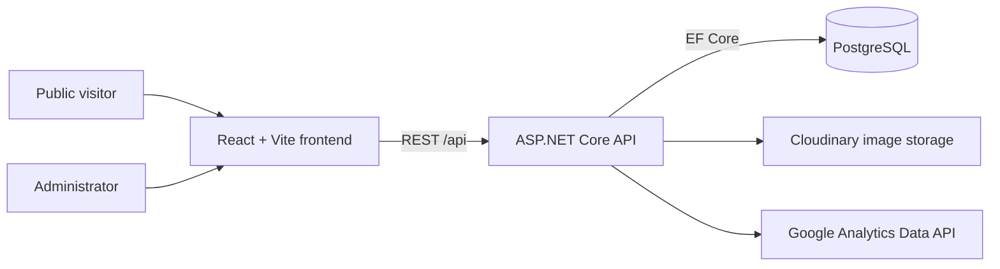
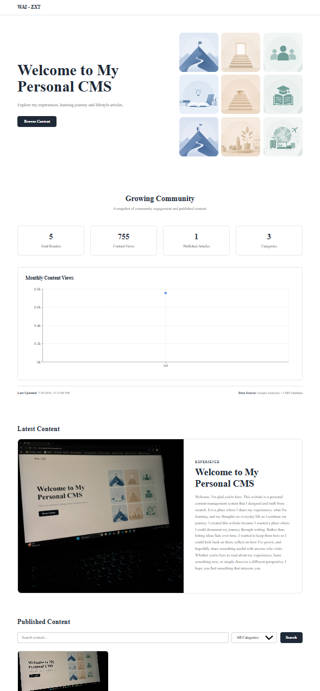
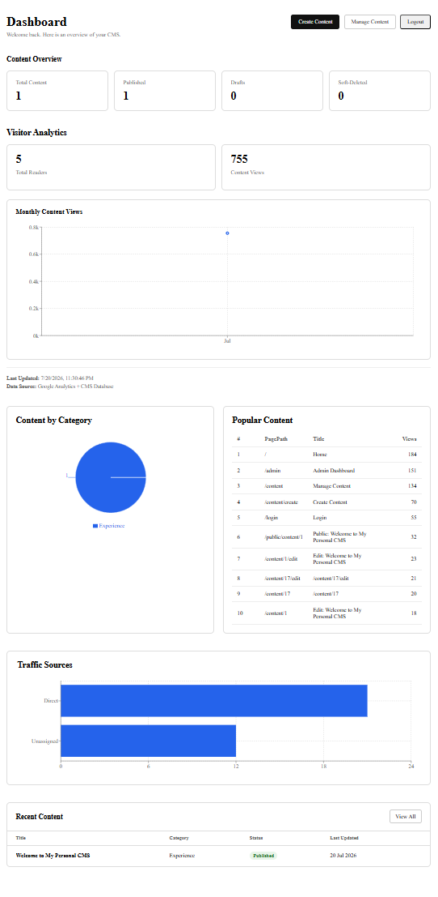
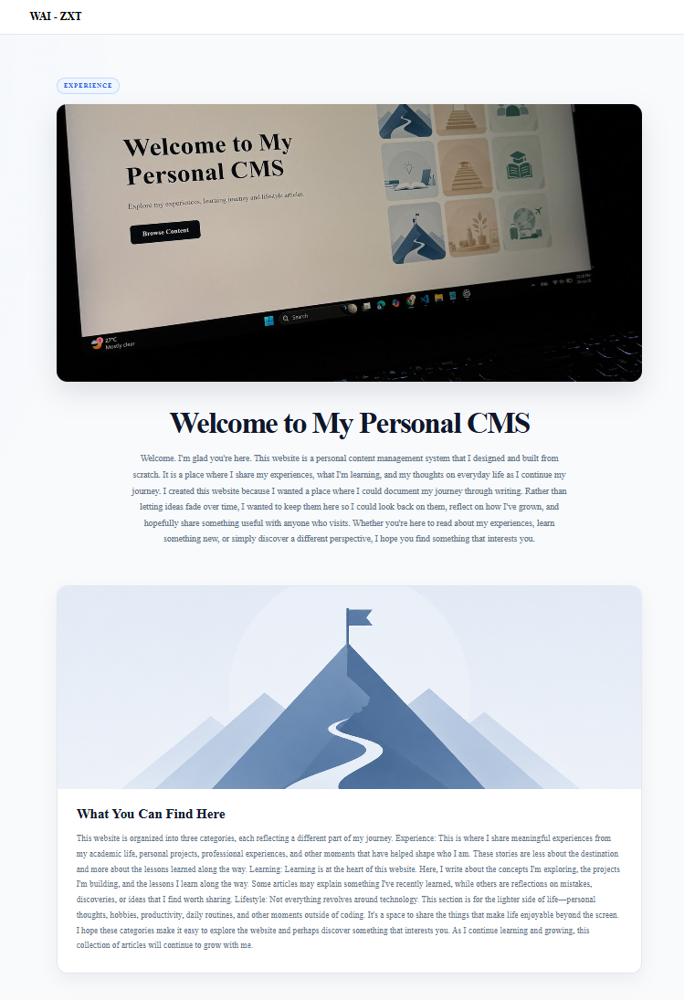
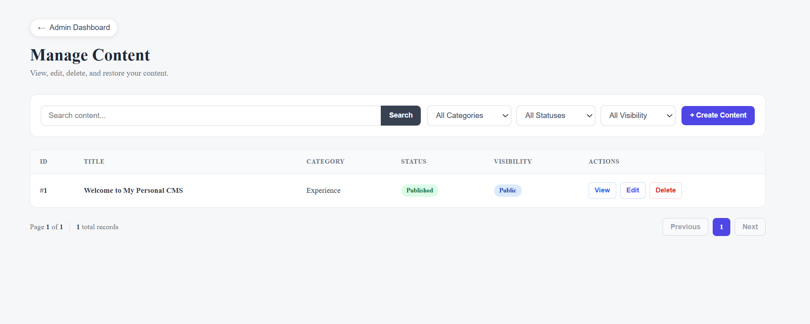
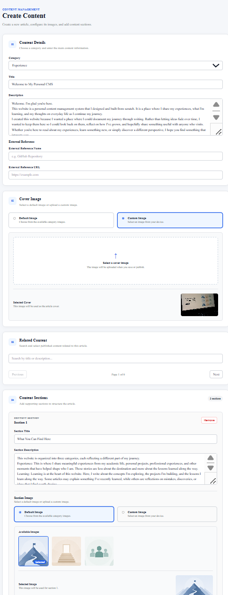
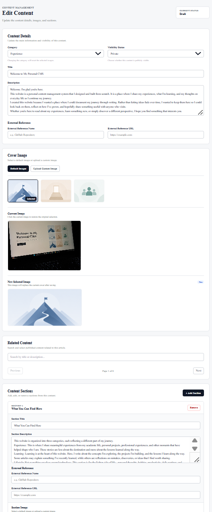

# Personal CMS

[](https://dotnet.microsoft.com/)
[](https://react.dev/)
[](https://www.postgresql.org/)
[](https://www.docker.com/)

A full-stack personal Content Management System (CMS) built as a portfolio project. It enables an administrator to create, manage, and publish portfolio-style content while providing a responsive public-facing website for visitors.

## Live Demo

- Frontend: https://cms-frontend-5mn3.onrender.com/

## Table of contents

- [Features](#features)
- [Tech stack](#tech-stack)
- [System architecture](#system-architecture)
- [Project structure](#project-structure)
- [Screenshots](#screenshots)
- [Local setup](#local-setup)
- [Environment variables](#environment-variables)
- [Docker](#docker)
- [Deployment](#deployment-render--postgresql)
- [API documentation](#api-documentation)
- [Future improvements](#future-improvements)
- [License](#license)

## Features

### Public Website

- Browse published content
- Search and filter
- Pagination
- Related content
- Public dashboard

### Admin Panel

- JWT authentication
- Create content
- Edit content
- Drafts
- Publish
- Soft delete
- Restore

### Infrastructure

- Cloudinary
- Google Analytics
- PostgreSQL
- Docker

## Tech stack

| Area | Technologies |
| --- | --- |
| Frontend | React 19, TypeScript, Vite, React Router, Recharts, React GA4 |
| Backend | ASP.NET Core 10, C#, Entity Framework Core, Swagger/OpenAPI |
| Data | PostgreSQL, Npgsql |
| Services | Cloudinary, Google Analytics Data API |
| Security | JWT bearer authentication, ASP.NET Core rate limiting |
| Delivery | Docker Compose, GitHub Actions |

## System architecture



The frontend consumes the REST API through `VITE_API_BASE_URL`. The API initializes the configured administrator and applies pending EF Core migrations on startup.

## Project structure

```text
.
├── frontend/                 # React/Vite client application
│   └── src/                  # Pages, components, hooks, services, and styles
├── backend/
│   ├── Cms.Api/              # ASP.NET Core API
│   │   ├── Controllers/       # Public, admin, auth, image, and dashboard endpoints
│   │   ├── Data/              # DbContext, migrations, and initializer
│   │   ├── Entities/          # Domain models
│   │   ├── Repositories/      # Data-access layer
│   │   └── Services/          # Application and external-service integrations
│   └── Cms.Api.Tests/         # Unit and integration tests
├── docker/                    # Frontend and backend Dockerfiles
├── docs/                      # Documentation assets
├── .github/workflows/         # CI workflow
└── docker-compose.yml         # Local multi-container setup
```

## Screenshots

| Public Homepage | Admin Dashboard |
| --- | --- |
|  |  |

| Content Detail | Manage Content |
| --- | --- |
|  |  |

| Create Content | Edit Content |
| --- | --- |
|  |  |

## Local setup

### Prerequisites

- .NET SDK 10
- Node.js 22 and npm
- PostgreSQL 18, or Docker Desktop
- Cloudinary credentials and a Google Analytics service-account credential file

1. Create local configuration files from the examples:

   ```powershell
   Copy-Item backend/Cms.Api/.env.example backend/Cms.Api/.env
   Copy-Item frontend/.env.example frontend/.env
   ```

2. Set the required values described in [Environment variables](#environment-variables).

3. Start PostgreSQL:

   ```powershell
   docker compose up -d postgres
   ```

4. Start the API:

   ```powershell
   dotnet restore cms.slnx
   dotnet run --project backend/Cms.Api/Cms.Api.csproj
   ```

   The API runs at `http://localhost:5160` with the default HTTP launch profile.

5. In a second terminal, start the frontend:

   ```powershell
   npm install --prefix frontend
   npm run dev --prefix frontend
   ```

   Open `http://localhost:5173`.

## Environment variables

Backend variables belong in `backend/Cms.Api/.env`; frontend variables belong in `frontend/.env`. Do not commit either file.

| Variable | Required | Purpose |
| --- | --- | --- |
| `ConnectionStrings__DefaultConnection` | Yes | PostgreSQL connection string |
| `ALLOWED_ORIGINS` | Yes | Comma-separated allowed frontend origins |
| `Jwt__Issuer`, `Jwt__Audience`, `Jwt__Key`, `Jwt__TokenLifetimeHours` | Yes | JWT configuration; the signing key must be at least 32 bytes |
| `Cloudinary__CloudName`, `Cloudinary__ApiKey`, `Cloudinary__ApiSecret` | Yes | Cloudinary image upload and deletion |
| `InitialAdmin__Username`, `InitialAdmin__Password` | Yes | Administrator created during database initialization |
| `GOOGLE_APPLICATION_CREDENTIALS` | Yes | Path to the Google service-account credentials JSON |
| `VITE_API_BASE_URL` | Yes | Frontend base URL for the API, for example `http://localhost:5160/api` |
| `VITE_GA_MEASUREMENT_ID` | Optional | Enables frontend Google Analytics tracking |

The API also requires `GoogleAnalytics:PropertyId`; configure it through the application's configuration provider (for example, an environment variable named `GoogleAnalytics__PropertyId`).

## Docker

Docker Compose starts PostgreSQL, the API, and the Vite development server. Create the required .env files before running Docker Compose.

```powershell
docker compose up --build
```

Endpoints:

- Frontend: `http://localhost:5173`
- API: `http://localhost:5000`
- PostgreSQL: `localhost:5432`

The compose file supplies the API database connection for the container. Ensure `frontend/.env` uses an API URL reachable from the browser, such as `http://localhost:5000/api`.

## Testing

The backend includes unit and integration tests using xUnit. The frontend includes linting, automated builds, and CI through GitHub Actions.

## Deployment (Render + PostgreSQL)

The application is deployed on Render with a managed PostgreSQL database. Dockerfiles are included for local development and alternative deployment workflows.

1. Create a Render PostgreSQL database and copy its connection string into the API service as `ConnectionStrings__DefaultConnection`.
2. Create an API web service from `docker/backend/Dockerfile`; configure the backend variables above, including `ALLOWED_ORIGINS` with the deployed frontend URL and `GoogleAnalytics__PropertyId`.
3. Create a frontend web service from `docker/frontend/Dockerfile`; build it with `VITE_API_BASE_URL` set to the deployed API URL plus `/api`.
4. Add the Google service-account credential securely and set `GOOGLE_APPLICATION_CREDENTIALS` to its deployed path.
5. Use `GET /health/live` for liveness and `GET /health/ready` for database readiness checks.

The API runs database initialization on startup, including pending migrations and initial-admin setup. Treat the initial-admin password and all external-service credentials as deployment secrets.

## API documentation

Swagger UI is enabled in the Development environment at:

```text
http://localhost:5160/swagger
```

Use the **Authorize** button to provide a JWT for protected endpoints. The API includes public content and dashboard endpoints plus authenticated endpoints for authentication, content management, images, and the admin dashboard.

## Documentation

Additional project documentation is available in the `docs` directory, including:

- Project Planning
- Entity Relationship Diagram (ERD)
- Use Case Diagram
- Use Case Specifications
- Wireframes

## Future improvements

- Add production-ready frontend serving instead of the current Vite development container.
- Publish OpenAPI documentation outside the Development environment for controlled production access.
- Add end-to-end tests and deployment-specific infrastructure configuration.

## License

This project is licensed under the MIT License. See the `LICENSE` file for details.
